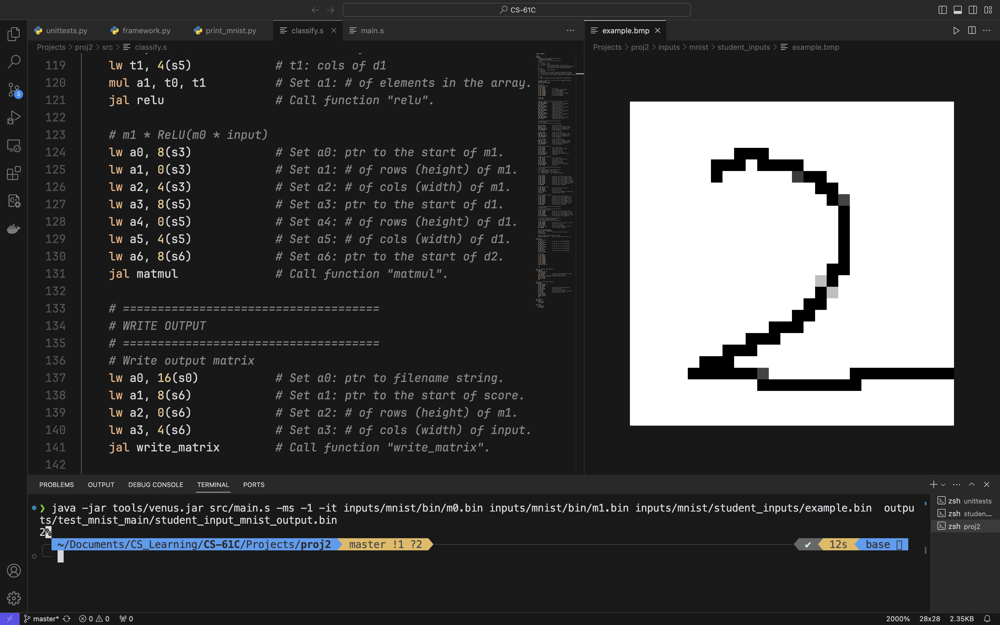
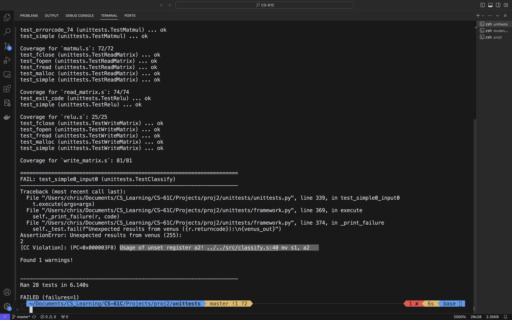

# Proj2

```
.
├── inputs (test inputs)
├── outputs (some test outputs)
├── README.md
├── src
│   ├── argmax.s (partA)
│   ├── classify.s (partB)
│   ├── dot.s (partA)
│   ├── main.s (do not modify)
│   ├── matmul.s (partA)
│   ├── read_matrix.s (partB)
│   ├── relu.s (partA)
│   ├── utils.s (do not modify)
│   └── write_matrix.s (partB)
├── tools
│   ├── convert.py (convert matrix files for partB)
│   └── venus.jar (RISC-V simulator)
└── unittests
    ├── assembly (contains outputs from unittests.py)
    ├── framework.py (do not modify)
    └── unittests.py (partA + partB)
```

## Here's what I did in project 2:

Mine works, hope you could get some help here. 🕺



All the tests passed, except for this…



The result show that it works fine, I don’t know why this would happen…

Anyways, I’ve done it! 😋
